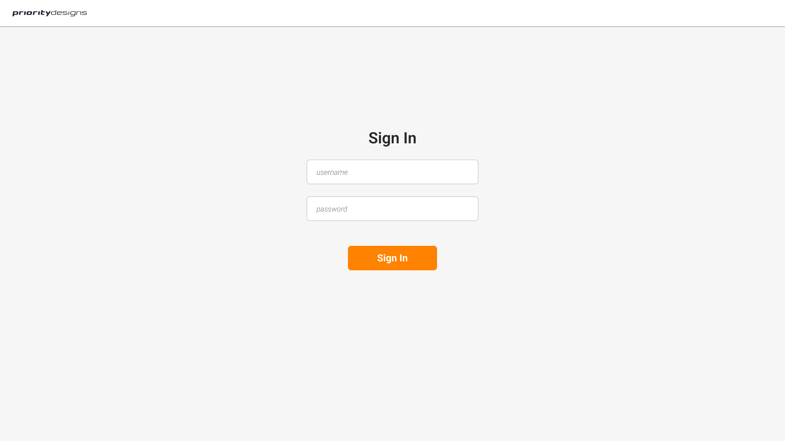

# Sign In - Code Kata
This is a front-end exercise to create a sign in form.

## UI Design
https://www.figma.com/file/RKKKSNm7EF7STqZWTJxP3n/SignInForm

## Feature - Sign In Existing User

### Scenario
- `GIVEN` a user already exists
- `WHEN` a username and password is entered
- `AND` the user clicks the sign in button
- `THEN` the username and password will be validated
- `AND` routed to the home page up valid input
